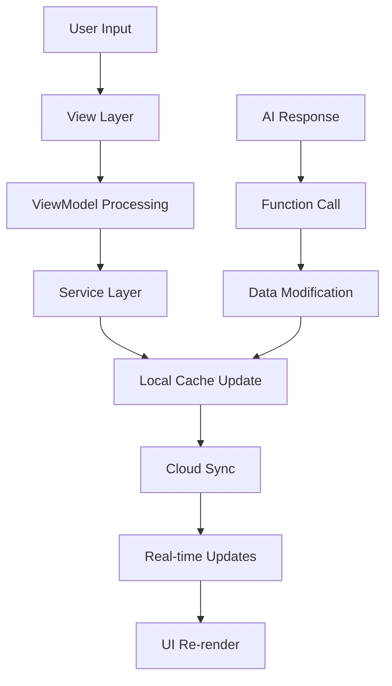
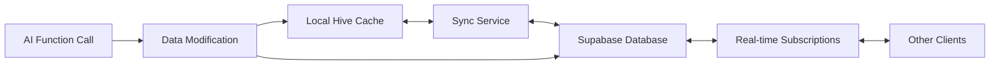
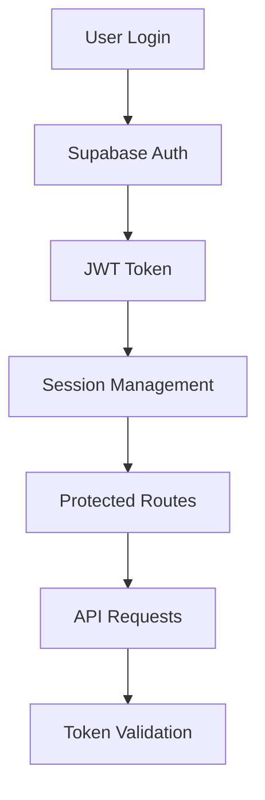

# Architecture Documentation

This document provides a comprehensive overview of the application's architecture, design patterns, and technical implementation details.

## Table of Contents

1. [System Architecture](#system-architecture)
2. [Data Flow](#data-flow)
3. [Component Architecture](#component-architecture)
4. [State Management](#state-management)
5. [Data Synchronization](#data-synchronization)
6. [AI Integration Architecture](#ai-integration-architecture)
7. [Security Architecture](#security-architecture)
8. [Performance Considerations](#performance-considerations)

## System Architecture

### Layered Architecture Pattern

The application follows a layered architecture with clear separation of concerns:

```
┌─────────────────────────────────────────────────────────────────┐
│                    Presentation Layer                           │
│  ┌─────────────────┐  ┌─────────────────┐  ┌─────────────────┐  │
│  │     Views       │  │   Components    │  │     Themes      │  │
│  │                 │  │                 │  │                 │  │
│  │ - Homepage      │  │ - Custom        │  │ - Light/Dark    │  │
│  │ - Todo Page     │  │   Buttons       │  │ - Gradients     │  │
│  │ - Goals Page    │  │ - Dialogs       │  │ - Typography    │  │
│  │ - Chat Screen   │  │ - Tiles         │  │                 │  │
│  │ - Settings      │  │ - Notifications │  │                 │  │
│  └─────────────────┘  └─────────────────┘  └─────────────────┘  │
└─────────────────────────────────────────────────────────────────┘
┌─────────────────────────────────────────────────────────────────┐
│                    Business Logic Layer                         │
│  ┌─────────────────┐  ┌─────────────────┐  ┌─────────────────┐  │
│  │   ViewModels    │  │     Services    │  │     Providers   │  │
│  │                 │  │                 │  │                 │  │
│  │ - TodoVM        │  │ - Auth Service  │  │ - Theme Provider│  │
│  │ - GoalsVM       │  │ - Sync Service  │  │ - Auth Provider │  │
│  │ - ChatVM        │  │ - AI Service    │  │ - Data Providers│  │
│  │ - SettingsVM    │  │ - Notification  │  │                 │  │
│  │                 │  │   Service       │  │                 │  │
│  └─────────────────┘  └─────────────────┘  └─────────────────┘  │
└─────────────────────────────────────────────────────────────────┘
┌─────────────────────────────────────────────────────────────────┐
│                      Data Layer                                 │
│  ┌─────────────────┐  ┌─────────────────┐  ┌─────────────────┐  │
│  │     Models      │  │      Cache      │  │   Supabase DB   │  │
│  │                 │  │                 │  │                 │  │
│  │ - Todo Model    │  │ - Hive Cache    │  │ - PostgreSQL    │  │
│  │ - Goal Model    │  │ - Local Storage │  │ - Real-time     │  │
│  │ - User Model    │  │ - Offline Data  │  │ - Functions     │  │
│  │ - AI Models     │  │                 │  │                 │  │
│  │                 │  │                 │  │                 │  │
│  └─────────────────┘  └─────────────────┘  └─────────────────┘  │
└─────────────────────────────────────────────────────────────────┘
┌─────────────────────────────────────────────────────────────────┐
│                    External Services                            │
│  ┌─────────────────┐  ┌─────────────────┐  ┌─────────────────┐  │
│  │   Supabase      │  │   Google AI     │  │   Firebase      │  │
│  │                 │  │                 │  │                 │  │
│  │ - Auth          │  │ - Gemini API    │  │ - Push Notif.   │  │
│  │ - Database      │  │ - Function Call │  │ - Analytics     │  │
│  │ - Functions     │  │ - Context Mgmt  │  │                 │  │
│  │ - Real-time     │  │                 │  │                 │  │
│  │                 │  │                 │  │                 │  │
│  └─────────────────┘  └─────────────────┘  └─────────────────┘  │
└─────────────────────────────────────────────────────────────────┘
```

### Architecture Principles

1. **Separation of Concerns**: Each layer has a specific responsibility
2. **Dependency Inversion**: High-level modules don't depend on low-level modules
3. **Single Responsibility**: Each component has one reason to change
4. **Open/Closed**: Components are open for extension but closed for modification

## Data Flow

### User Interaction Flow



### Data Synchronization Flow



### Authentication Flow



## Component Architecture

### View Models (Business Logic)

Each screen has a corresponding ViewModel that handles business logic:

```dart
class TodoViewModel extends Notifier<TodoState> {
  // State management
  // Business logic
  // Service coordination
}

class GoalsViewModel extends Notifier<GoalsState> {
  // State management
  // Business logic
  // Service coordination
}
```

**Responsibilities:**
- State management for specific screens
- Business logic implementation
- Service layer coordination
- Error handling and validation

### Services (Data Access)

Services handle data operations and external API calls:

```dart
class TodoSyncService {
  // Local cache operations
  // Cloud synchronization
  // Conflict resolution
}

class SupabaseGeminiService {
  // AI API integration
  // Function calling
  // Response processing
}
```

**Responsibilities:**
- Data persistence (local and cloud)
- API communication
- Error handling and retries
- Data transformation

### Providers (State Management)

Riverpod providers manage global application state:

```dart
final todoViewModelProvider = NotifierProvider<TodoViewModel, TodoState>(() => TodoViewModel());
final authServiceProvider = Provider<AuthService>((ref) => AuthService());
```

**Responsibilities:**
- Global state management
- Dependency injection
- State persistence
- Provider composition

## State Management

### Riverpod Architecture

The application uses Riverpod for reactive state management:

```dart
// Provider for immutable state
final todoProvider = Provider<List<Todo>>((ref) {
  return ref.watch(todoViewModelProvider).todos;
});

// Notifier for mutable state
final todoViewModelProvider = NotifierProvider<TodoViewModel, TodoState>(() => TodoViewModel());

// Async data provider
final userProvider = FutureProvider<User?>((ref) {
  return ref.watch(authServiceProvider).currentUser;
});
```

### State Patterns

1. **Immutable State**: State objects are immutable and recreated on changes
2. **Reactive Updates**: UI automatically updates when state changes
3. **Async Handling**: Built-in support for loading, error, and success states
4. **Dependency Tracking**: Automatic dependency management

### State Flow Example

```dart
class TodoState {
  final List<Todo> todos;
  final bool isLoading;
  final String? error;
  
  TodoState({this.todos = const [], this.isLoading = false, this.error});
  
  TodoState copyWith({List<Todo>? todos, bool? isLoading, String? error}) {
    return TodoState(
      todos: todos ?? this.todos,
      isLoading: isLoading ?? this.isLoading,
      error: error ?? this.error,
    );
  }
}
```

## Data Synchronization

### Dual-Layer Storage Strategy

The application implements a sophisticated synchronization system:

```dart
class TodoSyncService {
  final ConnectivityService connectivity;
  final TodoCache cache;
  
  // Sync from cloud to local
  Future<void> syncFromSupabase() async {
    if (!connectivity.isOnline) return;
    
    final todos = await supabase.from('todos').select();
    await cache.putAll(todos);
  }
  
  // Sync from local to cloud
  Future<void> syncToSupabase() async {
    if (!connectivity.isOnline) return;
    
    final todos = await cache.getAll();
    await supabase.from('todos').upsert(todos);
  }
}
```

### Conflict Resolution

The system handles conflicts through:

1. **Last Write Wins**: Timestamp-based conflict resolution
2. **Merge Strategies**: Intelligent merging of field-level changes
3. **User Resolution**: Manual conflict resolution for critical data

### Offline Support

```dart
class OfflineUtils {
  static bool isOfflineError(Exception e) {
    return e.toString().contains('network') ||
           e.toString().contains('connection');
  }
  
  static Future<void> retryWithBackoff(Future<void> Function() operation) async {
    int attempts = 0;
    const maxAttempts = 5;
    
    while (attempts < maxAttempts) {
      try {
        await operation();
        return;
      } catch (e) {
        if (isOfflineError(e)) {
          attempts++;
          await Future.delayed(Duration(seconds: pow(2, attempts).toInt()));
          continue;
        }
        rethrow;
      }
    }
  }
}
```

## AI Integration Architecture

### Function Calling Pattern

The application uses structured function calling for AI interactions:

```typescript
// Supabase Edge Function
const todoTool = {
  functionDeclarations: [{
    name: 'addTodo',
    description: 'Adds a new to-do item.',
    parameters: {
      type: 'object',
      properties: {
        task: { type: 'string' },
        importance: { type: 'string', enum: ['IMPORTANT', 'NOT IMPORTANT'] },
        urgency: { type: 'string', enum: ['URGENT', 'NOT URGENT'] },
        description: { type: 'string' },
        dueDate: { type: 'string' },
        isCompleted: { type: 'boolean' }
      },
      required: ['task', 'importance', 'urgency']
    }
  }]
};
```

### Context Management

AI has access to comprehensive user context:

```dart
// Context building
String buildSystemPrompt(UserData userData) {
  return '''
  You have access to:
  - User todos: ${summarizeTodos(userData.todos)}
  - User goals: ${summarizeGoals(userData.goals)}
  - User personality: ${summarizePersonality(userData.personality)}
  - User preferences: ${summarizePreferences(userData.additionalInfo)}
  
  Use this context to provide personalized responses.
  ''';
}
```

### Response Processing

```dart
class AIResponseProcessor {
  Future<void> processFunctionCall(FunctionCall call) async {
    switch (call.name) {
      case 'addTodo':
        await todoService.createTodo(call.args);
        break;
      case 'modifyGoal':
        await goalService.updateGoal(call.args);
        break;
      // Handle other function calls
    }
  }
}
```

## Security Architecture

### Authentication & Authorization

```dart
class AuthService {
  // JWT-based authentication
  Future<AuthResponse> signIn(String email, String password) async {
    return await supabase.auth.signInWithPassword(
      email: email,
      password: password,
    );
  }
  
  // Session management
  Stream<AuthState> get onAuthStateChange => supabase.auth.onAuthStateChange;
  
  // Token refresh
  Future<void> refreshSession() async {
    await supabase.auth.refreshSession();
  }
}
```

### Data Security

1. **Row Level Security (RLS)**: Database policies ensure users only access their data
2. **JWT Validation**: All API requests are validated with JWT tokens
3. **Secure Storage**: Sensitive data is encrypted in local storage
4. **Input Validation**: All user inputs are validated and sanitized

### API Security

```sql
-- Example RLS Policy
CREATE POLICY "Users can only access their own todos"
ON todos
FOR ALL
USING (user_id = auth.uid());
```

## Performance Considerations

### Caching Strategy

```dart
class TodoCache {
  final Box<Todo> box;
  
  // Lazy loading
  Stream<List<Todo>> watchAll() {
    return box.watch().map((_) => box.values.toList());
  }
  
  // Batch operations
  Future<void> putAll(List<Todo> todos) async {
    await box.putAll(Map.fromEntries(
      todos.map((todo) => MapEntry(todo.id, todo))
    ));
  }
}
```

### Memory Management

1. **Lazy Loading**: Data is loaded on-demand
2. **Pagination**: Large datasets are paginated
3. **Caching**: Frequently accessed data is cached
4. **Cleanup**: Unused data is periodically cleaned up

### Network Optimization

```dart
class NetworkOptimizer {
  // Request batching
  Future<void> batchRequests(List<Future<void>> requests) async {
    await Future.wait(requests);
  }
  
  // Compression
  String compressData(String data) {
    return gzip.encode(utf8.encode(data)).toString();
  }
  
  // Retry logic
  Future<T> retryOperation<T>(Future<T> Function() operation) async {
    return OfflineUtils.retryWithBackoff(() => operation());
  }
}
```

### UI Performance

1. **Virtualization**: Long lists use virtualization
2. **Image Optimization**: Images are compressed and cached
3. **Animation Optimization**: Smooth animations with proper performance
4. **State Minimization**: Minimal state updates for better performance

## Monitoring & Observability

### Error Tracking

```dart
class ErrorHandler {
  static void reportError(Object error, StackTrace stack) {
    // Log to console
    print('Error: $error\nStack: $stack');
    
    // Report to monitoring service
    // FirebaseCrashlytics.recordError(error, stack);
  }
}
```

### Performance Monitoring

1. **App Metrics**: Load times, response times, error rates
2. **User Analytics**: Feature usage, engagement metrics
3. **System Health**: Database performance, API response times
4. **AI Performance**: Function call success rates, response times

This architecture provides a robust, scalable, and maintainable foundation for the AI-powered productivity application while ensuring excellent performance and user experience.